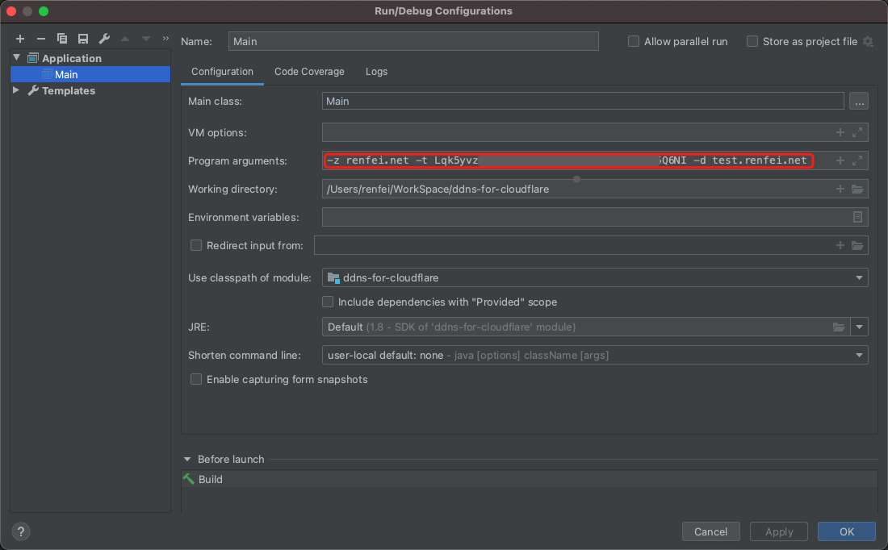

[English](README.md) | [简体中文](README_ZH.md)
# DDNS-for-Cloudflare
The DDNS (Dynamic Domain Name Server) practice case based on Cloudflare APIv4.

## Dependent Service
- [ip.renfei.net](https://ip.renfei.net)
- [cloudflare](https://gitee.com/rnf/cloudflare)

## Getting Started
First, download the latest jar: [https://github.com/renfei/ddns-for-cloudflare/releases/download/1.0.0/ddns-1.0.0.jar](https://github.com/renfei/ddns-for-cloudflare/releases/download/1.0.0/ddns-1.0.0.jar)

Run jar and pass parameters:
- -z zone: domain name managed in cloudflare, for example: renfei.net
- -t token: API token in cloudflare [https://dash.cloudflare.com/profile/api-tokens](https://dash.cloudflare.com/profile/api-tokens)
- -d domain: set the domain name of DDNS, for example: test.renfei.net

example:
```bash
java -jar ddns-1.0.0.jar -z renfei.net -t kK8tQ1gY1mV3hH4jJ9yN9zP8bL1hB6uU6vB2tT1o -d test.renfei.net
```
Background operation cases:
```bash
nohup java -jar ddns-1.0.0.jar -z renfei.net -t kK8tQ1gY1mV3hH4jJ9yN9zP8bL1hB6uU6vB2tT1o -d test.renfei.net >ddns.log 2>&1 &
```

## Development and Debugging
Before debugging, set the```Program arguments```:
```bash
-z <zone> -t <token> -d <domain>
# example:
-z renfei.net -t kK8tQ1gY1mV3hH4jJ9yN9zP8bL1hB6uU6vB2tT1o -d test.renfei.net
```
