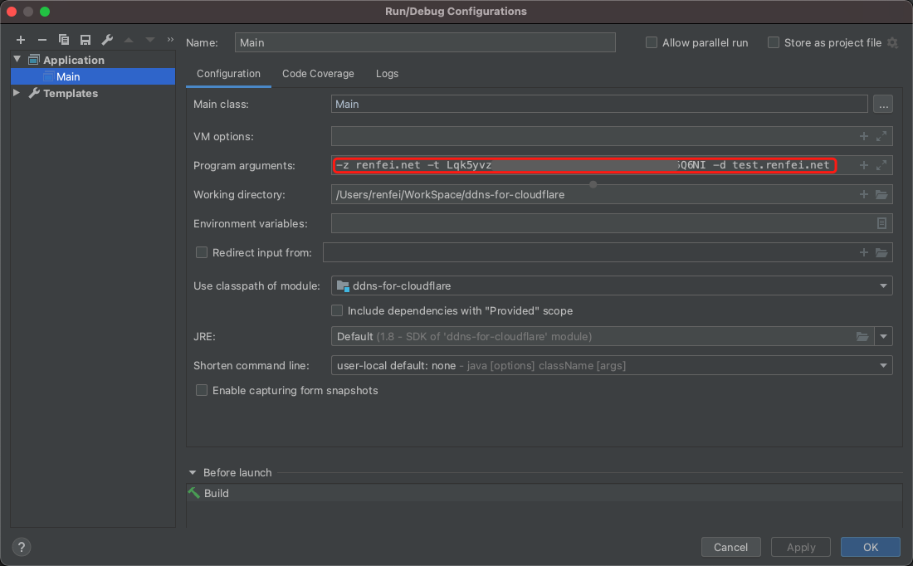

[English](README.md) | [简体中文](README_ZH.md)
# DDNS-for-Cloudflare
基于 Cloudflare APIv4 的 DDNS (Dynamic Domain Name Server，动态域名服务) 实践案例。

## 依赖服务
- [ip.renfei.net](https://ip.renfei.net)
- [cloudflare](https://gitee.com/rnf/cloudflare)

## 开发调试
在运行调试前，设置```Program arguments```:
```bash
-z <zone> -t <token> -d <domain>
# 例如：
-z renfei.net -t kK8tQ1gY1mV3hH4jJ9yN9zP8bL1hB6uU6vB2tT1o -d test.renfei.net
```
